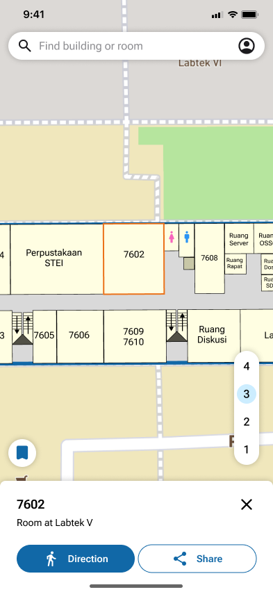
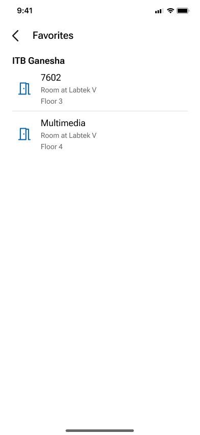
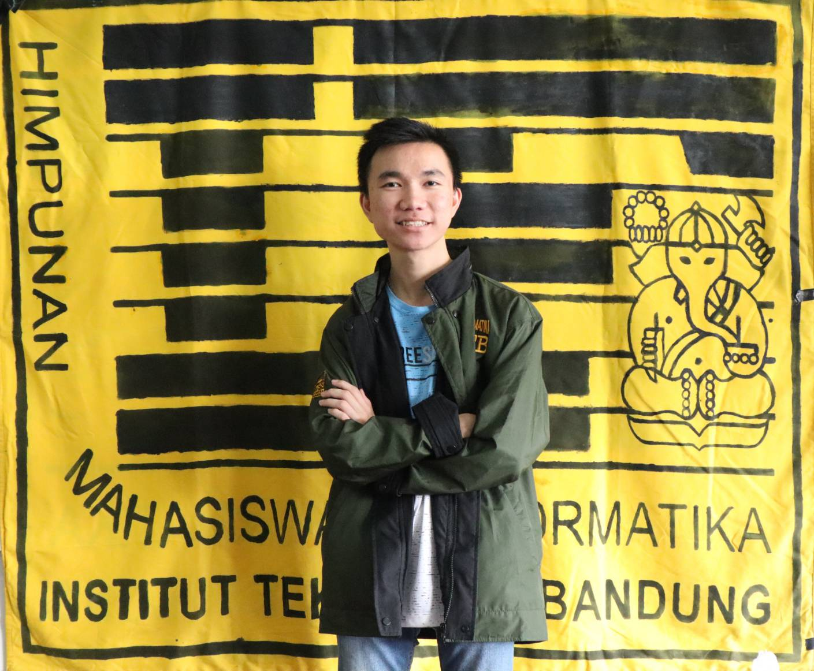
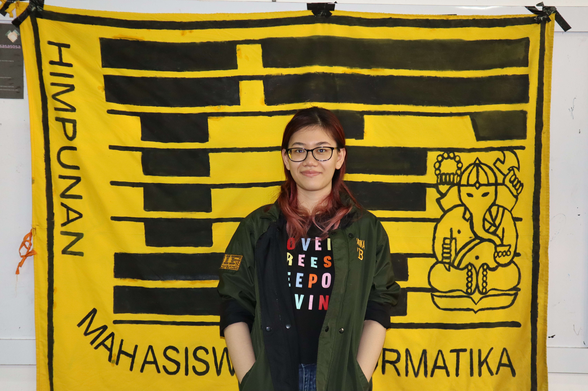

<br>
<div align="center">
    <div >
        
    </div>
    <div>
        <p><i>Your indoor navigation assistant</i></p>
    </div>      
</div>
<br>
<h1 align="center">UniMap Mobile Application</h1>

<div align="center">
    
    
</div>

Universal Map (also called UniMap) is a your pocket sized travel companion designed to provide dynamic and interactive maps of indoor rooms and areas on public spaces such as hospitals, universities, and more!

## 👨🏻‍💻 &nbsp;Technology Stack
- React Native
- Expo
- Supabase
- MapBox

## Getting Started
There are two methods you can use to run UniMap on your device.
### 1. Install the APK
1. Download the latest release on our GitHub page to your mobile Android device
2. Install the APK
3. Enjoy UniMap!
### 2. Run via Expo

To run UniMap using Expo, make sure these following dependencies are installed on your machine.

- Node.js

After the prerequisites are installed, follow the steps below.

1. Clone this repository from your terminal of choice using the following command
```bash
git clone https://github.com/ProjektUniMap/UniMap-mobile.git
```
2. Install node dependecies using this command
```bash
npm install
```
3. Run the app using the following command
```bash
npm run android
```

## 👥 &nbsp;Contributors

| <a href="https://github.com/frendysanusi"></a> | <a href="https://github.com/fawwazabrials"></a> | <a href="https://github.com/cathlauretta"></a>
| ---------------------------------------------------------------------------------------------------------------------------------------------------------------------------------------------------------------------------------- | ----------------------------------------------------------------------------------------------------------------------------------------------------------------------------------------------------------------------------------- | -------------------------------------------------------------------------------------------------------------------------------------------------------------------------------------------------------------------------- |
| <div align="center"><h3><b><a href="https://github.com/frendysanusi">Frendy Sanusi</a></b></h3><i><p>Bandung Institute of Technology</i></p></div>                                                                               | <div align="center"><h3><b><a href="https://github.com/fawwazabrials">Fawwaz Abrial Saffa</a></b></h3></a><p><i>Bandung Institute of Technology</i></p></div>                                                                          | <div align="center"><h3><b><a href="https://github.com/cathlauretta">Cathleen Lauretta</a></b></h3></a><p><i>Bandung Institute of Technology</i></p></div>                                                           